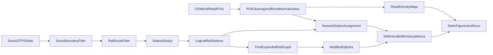

# Methodology

## Pipeline Overview

## Data Sources

SwissReach currently combines three source families:

- Swiss GTFS static timetable for the transport network
- Swiss national boundary geometry from `swisstopo`
- OpenStreetMap-derived POIs for schools, hospitals, IKEA, and supermarkets

The supermarket layer is exported separately and normalized in `data/scripts/fetch_swiss_supermarkets.py`. The insight figures and docs assets are then generated in `data/scripts/export_storytelling_assets.py`.

## Rail Preprocessing

The preprocessing pipeline follows four steps:

1. Load the GTFS static feed and Swiss national boundary.
2. Keep only stops located inside Switzerland.
3. Filter routes and trips to rail services.
4. Collapse platform-level stops into logical stations using `parent_station` when available.

This design reduces noise while preserving a national view of the rail network.

## Reachability Model

The reachability engine builds a **time-expanded graph** from GTFS stop times and computes **earliest arrival times** from a chosen origin station. For the insight export, the project fixes departure time at `08:00` and derives two horizons:

- `30` minutes for daily amenities
- `60` minutes for IKEA access

Key assumptions in the current model:

- static timetable, no live delays
- rail-only services
- fixed minimum transfer dwell of `3` minutes
- staying on the same train is free
- output is reachability and travel time, not full itinerary explanation

The resulting model is well suited to:

- isochrone-style maps
- comparing origins
- comparing departure times
- producing front-end friendly station-level outputs

## POI Integration

SwissReach does not run full door-to-door routing to every supermarket, school, or hospital. Instead, POIs are first assigned to the **nearest logical rail station** in projected Swiss coordinates (`EPSG:2056`).

This gives two useful abstractions:

1. a count of amenities "attached" to each station
2. a simple way to aggregate reachable amenities after the timetable search is complete

The three analytical layers use this mechanism as follows:

- `supermarkets_30min`: number of supermarket POIs attached to stations reachable within `30` minutes
- `schools_30min`: number of school POIs attached to stations reachable within `30` minutes
- `hospitals_30min`: number of hospital POIs attached to stations reachable within `30` minutes
- `ikea_60min`: number of IKEA POIs attached to stations reachable within `60` minutes

## Retail Dataset And Density Maps

The supermarket export script builds a normalized food-retail dataset with three layers:

- `supermarket_core`
- `supermarket_secondary`
- `convenience`

For the docs insights page, the `Migros` and `Coop` subsets are exported again in a minimal JSON format and visualized with spatial density plots. This density view is not a reachability metric; it is a **retail geography** comparison layer.

## Routing Algorithm Choice

Milestone 1 does **not** require a more complex routing algorithm.

The present task is a feasibility study for **reachability visualization**, not a production journey planner. For this use case, the current modified Dijkstra approach remains appropriate because:

- the state space is already reduced to `1,938` logical rail stations
- the interaction focus is on earliest arrival and coverage
- the result can be cached and reused for repeated parameter choices

If the final project later shifts toward richer itinerary planning, likely upgrade paths include:

- path reconstruction on top of the current graph
- explicit walking edges
- RAPTOR or CSA-style public transport routing

## Current Limitations

The current Milestone 1 prototype has several modeling boundaries:

- **Rail-only:** bus, tram, cable car, and boat access are excluded.
- **No explicit walking network:** transfer time is represented by a fixed dwell constant, not by station geometry or street routing.
- **Nearest-station POI proxy:** amenities are attached to stations rather than reached through a full last-mile walk model.
- **Swiss-only clipping:** border stations are kept only insofar as the stop lies inside Switzerland, so some real cross-border accessibility is understated.
- **Station-level deduplication:** excellent for map readability, but not detailed enough for precise platform-by-platform transfer modeling.
- **OSM completeness:** school, hospital, IKEA, and retail coverage depends on community-maintained POI quality.

## Future Extensions

Beyond Milestone 1, the most realistic next steps are the following:

1. Add `transfers.txt` and, where available, `pathways.txt` to improve transfer realism.
2. Add a limited walking layer using nearby-stop links or an OpenStreetMap pedestrian graph.
3. Replace nearest-station amenity attachment with explicit last-mile travel for selected cities.
4. Add interactive filters for amenity type, retail brand, and time horizon in the published site.
