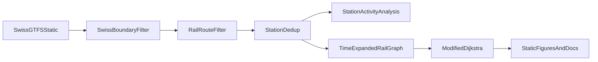

# Methodology

## Pipeline Overview

## Data Preprocessing

The preprocessing logic currently follows four steps:

1. Load the GTFS static feed and Swiss national boundary.
2. Keep only stops located inside Switzerland.
3. Filter routes and trips to rail services.
4. Collapse platform-level stops into logical stations using `parent_station` when available.

This design is appropriate for a data visualization project because it reduces noise while preserving a national view of the rail network.

## Reachability Model

The current reachability engine builds a **time-expanded graph** from GTFS stop times and computes **earliest arrival times** from a chosen origin station.

Key assumptions in the current model:

- static timetable, no live delays
- rail-only services
- fixed minimum transfer dwell of `3` minutes
- staying on the same train is free
- output is reachability and travel time, not full itinerary explanation

This makes the model well-suited for:

- isochrone-style maps
- comparing origins
- comparing departure times
- producing front-end friendly station-level outputs

## Why We Keep Dijkstra For Now

We do **not** currently need a more exotic routing algorithm for Milestone 1.

The present task is a feasibility study for **reachability visualization**, not a production journey planner. For this use case, the current modified Dijkstra approach is acceptable because:

- the state space is already reduced to `1,663` logical rail stations
- the interaction focus is on earliest arrival and coverage
- the result can be cached and reused for repeated parameter choices

If the final project later shifts toward richer itinerary planning, likely upgrade paths would include:

- path reconstruction on top of the current graph
- explicit walking edges
- RAPTOR or CSA-style public transport routing

## Current Limitations

The current Milestone 1 prototype has several modeling boundaries that should be stated explicitly:

- **Rail-only:** bus, tram, cable car, and boat access are excluded.
- **No explicit walking network:** transfer time is represented by a fixed dwell constant, not by station geometry or street routing.
- **Swiss-only clipping:** border stations are kept only insofar as the stop lies inside Switzerland, so some real cross-border accessibility is understated.
- **Station-level deduplication:** excellent for map readability, but not detailed enough for precise platform-by-platform transfer modeling.

## Future Extensions

If the project expands after Milestone 1, the most realistic next steps are:

1. Add `transfers.txt` and, where available, `pathways.txt` to improve transfer realism.
2. Add a limited walking layer using nearby-stop links or an OpenStreetMap pedestrian graph.
3. Compare rail-only accessibility with multimodal accessibility for a few representative corridors.
4. Add itinerary reconstruction for point-and-click explanations in the final interface.
