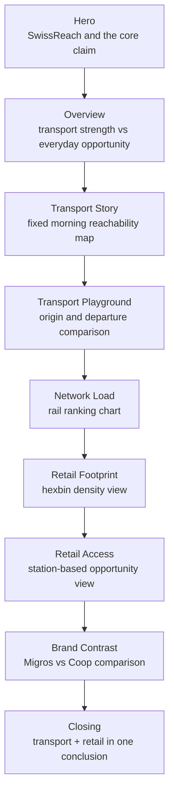
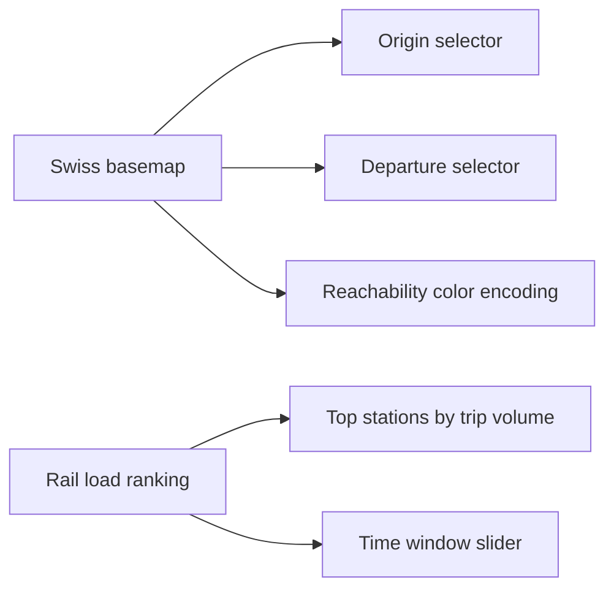
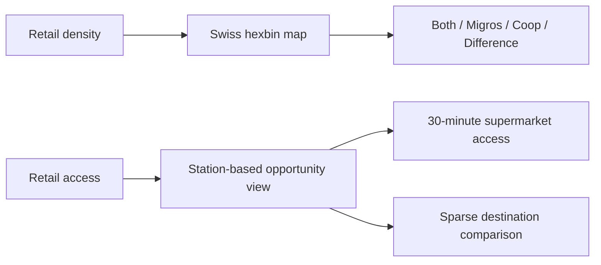

# Milestone 2 Report

## Project Goal

SwissReach studies **how Swiss public transport accessibility translates into everyday opportunity**. The project began as a nationwide rail-reachability visualization, then evolved into a broader story about what that mobility backbone actually enables in daily life.

The final product is a story-driven website built around two linked questions:

1. Where is the Swiss public-transport network strong, weak, or uneven?
2. How do those differences affect practical access to supermarkets and other everyday destinations?

Our target audience is broad but concrete: students, commuters, and readers interested in regional inequality, everyday mobility, and service access in Switzerland. The website is designed to be readable without specialist GIS knowledge. It should feel closer to an editorial visual story than to a route planner or a research dashboard.

At the center of the project is a simple argument:

**mobility explains connection, but retail and amenity layers explain opportunity.**

This framing makes the project more original than a standard travel-time map. It also gives us a clear narrative structure for the final site: start with the national rail backbone, then move toward accessible supermarkets, retail density, and brand differences.

## Final Product Sketches

The final product is planned as a single scrolling website with discrete sections. Each section answers one question and uses one dominant visual form.

### Sketch 1: final page flow

### Sketch 2: transport section

This section establishes the backbone of the story. It uses a Swiss map for spatial reachability and a separate ranking chart for network intensity.

### Sketch 3: retail section

This section shifts from pure transport geometry to store geography and reachable opportunity. The hexbin retail view is intentionally different from the transport map so the website does not become visually repetitive.

## Tech Stack

The final product relies on a compact stack that is already used in the current prototype.

| Visualization / page | Tech stack |
| --- | --- |
| Hero and page structure | Vue 3, Vite, CSS, VitePress |
| National reachability map | D3.js, SVG, GeoJSON, Vue state |
| Rail load ranking | D3.js bar chart, sliders, transitions |
| Retail density hexbin | D3.js custom SVG geometry, brand filtering |
| Retail access comparison | D3.js station-level map and comparison views |
| Narrative sequencing | Vue page composition, scroll-driven transitions |
| Data preprocessing and exports | Python scripts, GTFS processing, JSON exports |

## Implementation Breakdown

We split the final goal into independent pieces so that the core website remains meaningful even if some advanced ideas are dropped.

### Core visualization (minimum viable product)

The minimum viable product for SwissReach is:

1. A working story website with clear sections and a stable navigation skeleton.
2. A national rail reachability view with selectable origin and departure time.
3. A second transport view showing network intensity or ranking.
4. A retail density view showing where supermarkets cluster in Switzerland.
5. A retail-access view showing how many supermarkets can be reached from stations within a fixed time threshold.
6. A clear concluding section that explains why transport and retail must be read together.

If those six pieces work, the project already communicates its core meaning even without extra polish.

### Independent implementation pieces

1. **Transport backbone**
   - Reachability map
   - Departure and origin controls
   - Rail-load ranking

2. **Retail footprint**
   - National supermarket data layer
   - Branded filtering
   - Hexbin aggregation for clearer density reading

3. **Retail access**
   - Station-level supermarket opportunity counts
   - Fixed-baseline explanation
   - A second contrast category such as IKEA or sparse destination retail

4. **Narrative product shell**
   - Hero
   - Overview
   - Story panels
   - Closing section
   - Documentation and report pages

These pieces are largely independent: transport views, retail views, and product framing can all be improved without blocking one another.

### Extra ideas that improve the final product but are optional

- Canton-level retail comparison view
- Additional brand views beyond Migros and Coop
- A stronger synthesis chart for “transport strength vs retail opportunity”
- More non-map views to reduce visual repetition
- Higher-fidelity multimodal transport layers beyond the current rail-first backbone
- More polished editorial transitions and richer mobile-specific layouts

These ideas would enhance the final website, but dropping them would not endanger the main argument of the project.

## Functional Prototype Review

The project already has a functional prototype website running at [swissreach.online](https://swissreach.online/) with a matching documentation site at [swissreach.online/docs](https://swissreach.online/docs/).

The current prototype already includes:

- a working single-page product structure
- a scroll-based story sequence
- a national reachability map
- a Lausanne reachability panel with departure-window comparison
- a rail load ranking chart
- a retail density view
- a retail access view
- a brand comparison mode for Migros and Coop

This means the Milestone 2 prototype requirement is already satisfied: the website is running, the visual skeleton exists, and the main widgets are present.

What remains for the final milestone is not building from zero, but tightening the website into a more coherent final experience:

- cleaner visual hierarchy
- stronger distinction between views
- tighter final copy
- clearer synthesis between transport and retail
- selective polishing rather than broad expansion

## Conclusion

SwissReach now has a clear final direction. The project is no longer only a rail-accessibility map. It is becoming a narrative website about how Swiss mobility infrastructure shapes practical everyday opportunity.

The current prototype proves that the main technical building blocks already work. The remaining challenge is to refine them into a consistent final product with a strong visual identity, a readable narrative flow, and a small number of carefully chosen views that each answer one clear question.
